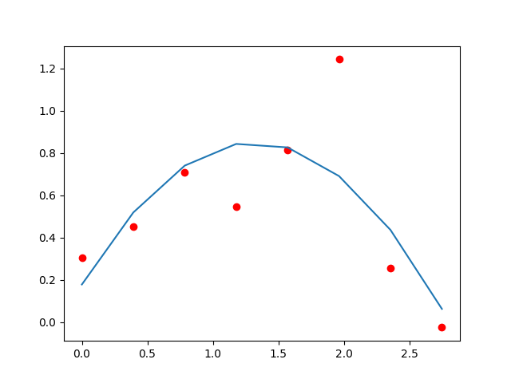

# Fitting

Least square fitting is done using the scipy package. 

This folder contains convenient wrappers for fitting data from pandas DataFrames, as well as toy programs which demonstrate how to use
the scipy package and pyplot to visualize fitting on artificial data. 

Sample results from the different test programs are stored in the Img/ directory. 

## fit_test_simple

Generates data from sin curve (sin(x) from x=0->2pi) with random noise. Tries to fit data. Example:

