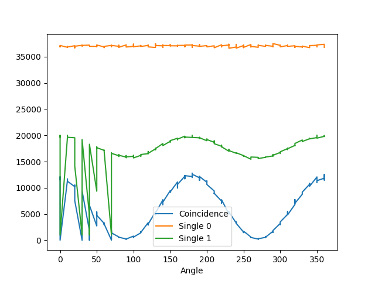
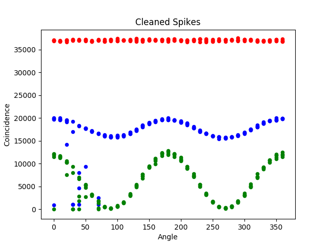
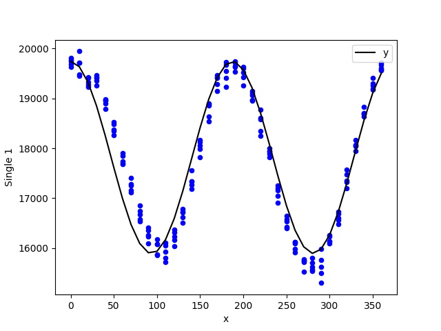
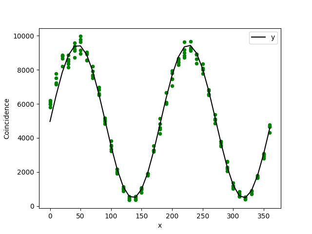

# QE
Quantum Entanglement Demonstration through violation of Bell's Inequality

## Setup Instructions

1. Use Linux

2. Install virtualenv to set up proper python environment. On systems with apt: `sudo apt install virtualenv`

3. Set up and activate python virtual environment
```
virtualenv -p python3 venv    # create virtual environment for python3
source venv/bin/activate      # activate virtual environment
```

4. Install required python libraries
```
pip install -r requirements.txt    # install pip requirements listed in requirements.txt
sudo apt install python3-tk        # GUI library required by matplotlib (not available from pip)
```

5. Run `python plot.py [PATH(S)_TO_DATA]`

`[PATH(S)_TO_DATA]` may contain multiple files, so the following is a nice way to clean, plot, and fit all Day_2_Data:
```
python plot.py Day_2_Data/*Plot
```
The resulting .pngs will be placed in Results/Day_2_Data/





There are still spikes on the left because this was our first experiment, and we switched from blocking one polarizer to the other. The spike cleaning algorithm is currently based off values from polarizer alpha (red) only. 

Fitting:




