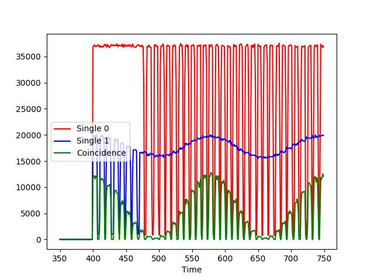

# QE
Quantum Entanglement Demonstration through violation of Bell's Inequality

## Setup Instructions

1. Use Linux

2. Install virtualenv to set up proper python environment. On systems with apt: `sudo apt install virtualenv`

3. Set up and activate python virtual environment
```
virtualenv -p python3 venv    # create virtual environment for python3
source venv/bin/activate      # activate virtual environment
```

4. Install required python libraries
```
pip install pandas            # data analysis library
pip install matplotlib        # graph plotting library
sudo apt install python3-tk   # GUI library required by matplotlib (not sure why there isn't a pip package for this)
```

5. Run `python plot.py`


